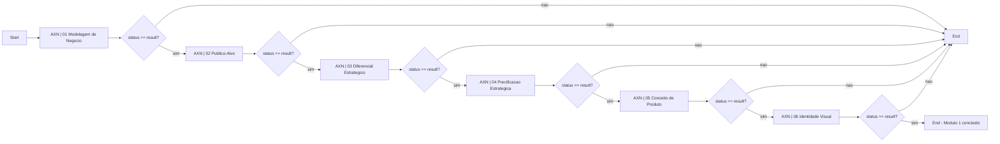

# Blueprint - Agent Builder / Operacao Comercial Modulo 1

Esta blueprint descreve como montar o fluxo conversacional fixo do Modulo 1 da Operacao Comercial no OpenAI Agent Builder.

Objetivo: conduzir o usuario por uma serie de agentes especializados ate gerar o Planejamento Estrategico Operacional inicial, sem depender de um orquestrador inteligente decidindo a ordem.

## Decisao de arquitetura

- A ordem dos agentes e fixa.
- O usuario enxerga uma conversa unica no app/site.
- Cada agente conduz somente a sua etapa.
- Cada chamada do workflow responde uma mensagem do usuario e termina.
- O app/banco guarda o estado oficial: agente atual, etapa atual, historico, blocos de transferencia e documento operacional acumulado.
- O Agent Builder e a fonte principal do fluxo conversacional.
- O n8n fica fora da orquestracao principal da conversa e pode ser usado depois para automacoes assincronas.

## Fluxo serial

1. `business_modeling` -> AXN | 01 Modelagem de Negocio
2. `target_audience` -> AXN | 02 Publico-Alvo
3. `strategic_differentiation` -> AXN | 03 Diferencial Estrategico
4. `strategic_pricing` -> AXN | 04 Precificacao Estrategica
5. `product_concept` -> AXN | 05 Conceito de Produto
6. `visual_identity` -> AXN | 06 Identidade Visual
7. Fim do Modulo 1 -> Planejamento Estrategico Operacional pronto para revisao

## Regra central

Cada agente deve responder sempre em JSON estruturado.

Enquanto ainda estiver conversando:

```json
{
  "status": "conversation",
  "assistant_message": "Mensagem curta que o aluno vera no chat.",
  "transfer_block": null,
  "next_agent_id": null
}
```

Quando concluir a etapa:

```json
{
  "status": "result",
  "assistant_message": "Transicao curta para o aluno.",
  "transfer_block": {
    "section_title": "Nome da secao produzida",
    "content": "Conteudo estruturado que entra no documento operacional"
  },
  "next_agent_id": "target_audience"
}
```

O campo `assistant_message` e o unico texto que deve aparecer no chat do aluno. O campo `transfer_block` e dado de sistema: deve ser salvo no projeto/documento operacional, nao mostrado como bloco tecnico para o usuario final.

## Regra de execucao

Se `status == "conversation"`:

- responder ao usuario com `assistant_message`;
- encerrar a execucao;
- manter o mesmo `current_agent_id` no projeto.

Se `status == "result"`:

- salvar `transfer_block` no projeto;
- atualizar o documento operacional;
- atualizar `current_agent_id` para `next_agent_id`;
- responder ao usuario com `assistant_message`;
- encerrar a execucao.

Importante: nao criar loop interno tentando continuar varios agentes na mesma execucao. A proxima mensagem do usuario inicia a proxima chamada, ja apontando para o agente atual salvo no estado.

## Desenho do fluxo no Agent Builder



Observacao: no produto final, o app pode chamar diretamente o agente salvo em `current_agent_id`. O fluxo visual acima serve para mapear a jornada e testar a transicao entre agentes.

## Expressao dos If / Else

Condicao basica:

```text
input.output_parsed.status == "result"
```

Condicao mais defensiva, quando quiser confirmar o proximo agente:

```text
input.output_parsed.status == "result" && input.output_parsed.next_agent_id == "target_audience"
```

Use a condicao defensiva quando a interface permitir. Caso contrario, use apenas `status == "result"` e valide `next_agent_id` no app/backend.

## Schema de saida recomendado

Todos os agentes devem usar o mesmo schema de saida:

```json
{
  "type": "object",
  "additionalProperties": false,
  "required": ["status", "assistant_message", "transfer_block", "next_agent_id"],
  "properties": {
    "status": {
      "type": "string",
      "enum": ["conversation", "result"]
    },
    "assistant_message": {
      "type": "string"
    },
    "transfer_block": {
      "type": ["object", "null"]
    },
    "next_agent_id": {
      "type": ["string", "null"]
    }
  }
}
```

## Entrada recomendada para o workflow

O app deve enviar contexto suficiente para o agente atual, sem expor dados desnecessarios.

```json
{
  "member": {
    "id": "MEMBER_ID",
    "email": "email@exemplo.com"
  },
  "project": {
    "id": "PROJECT_ID",
    "name": "Nome do Projeto",
    "current_agent_id": "business_modeling",
    "module_id": "module-1"
  },
  "message": "Mensagem atual do usuario",
  "thread": [
    {
      "role": "user",
      "content": "Mensagem anterior"
    },
    {
      "role": "assistant",
      "content": "Resposta anterior"
    }
  ],
  "operation_document": {
    "business_modeling": null,
    "target_audience": null,
    "strategic_differentiation": null,
    "strategic_pricing": null,
    "product_concept": null,
    "visual_identity": null
  }
}
```

## Mapa dos agentes

### 01 - Modelagem de Negocio

- `agent_id`: `business_modeling`
- Nome no Agent Builder: `AXN | 01 Modelagem de Negocio`
- Prompt: colar o conteudo de `source-material/Agents/revised-module-1/01-modelagem-de-negocio.md`
- Tools: Web Search ligado
- Modelo: modelo forte para estrategia
- Reasoning effort: low ou medium
- Output format: JSON com schema padrao
- Quando concluir: `next_agent_id = "target_audience"`
- Transfer block esperado: hipotese de negocio escolhida, sinais de mercado, restricoes, motivacoes e decisao principal.

### 02 - Publico-Alvo

- `agent_id`: `target_audience`
- Nome no Agent Builder: `AXN | 02 Publico-Alvo`
- Prompt: colar o conteudo de `source-material/Agents/revised-module-1/02-publico-alvo.md`
- Tools: Web Search ligado
- Modelo: modelo forte para estrategia
- Reasoning effort: low ou medium
- Output format: JSON com schema padrao
- Quando concluir: `next_agent_id = "strategic_differentiation"`
- Transfer block esperado: publico prioritario, dores, desejos, objeccoes, contexto de compra e canais provaveis.

### 03 - Diferencial Estrategico

- `agent_id`: `strategic_differentiation`
- Nome no Agent Builder: `AXN | 03 Diferencial Estrategico`
- Prompt: colar o conteudo de `source-material/Agents/revised-module-1/03-diferencial-estrategico.md`
- Tools: Web Search ligado
- Modelo: modelo forte para estrategia
- Reasoning effort: low ou medium
- Output format: JSON com schema padrao
- Quando concluir: `next_agent_id = "strategic_pricing"`
- Transfer block esperado: posicionamento, contraste com alternativas, promessa, diferencial defensavel e justificativa.

### 04 - Precificacao Estrategica

- `agent_id`: `strategic_pricing`
- Nome no Agent Builder: `AXN | 04 Precificacao Estrategica`
- Prompt: colar o conteudo de `source-material/Agents/revised-module-1/04-precificacao-estrategica.md`
- Tools: Web Search ligado
- Modelo: modelo forte para estrategia
- Reasoning effort: low ou medium
- Output format: JSON com schema padrao
- Quando concluir: `next_agent_id = "product_concept"`
- Transfer block esperado: modelo de preco, faixa inicial, valor percebido, custo de entrega, meta e validacao.

### 05 - Conceito de Produto

- `agent_id`: `product_concept`
- Nome no Agent Builder: `AXN | 05 Conceito de Produto`
- Prompt: colar o conteudo de `source-material/Agents/revised-module-1/05-conceito-de-produto.md`
- Tools: sem Web Search por padrao
- Modelo: modelo forte para sintese/criacao
- Reasoning effort: low
- Output format: JSON com schema padrao
- Quando concluir: `next_agent_id = "visual_identity"`
- Transfer block esperado: nome provisorio, promessa, formato, entregaveis, jornada e resultado esperado.

### 06 - Identidade Visual

- `agent_id`: `visual_identity`
- Nome no Agent Builder: `AXN | 06 Identidade Visual`
- Prompt: colar o conteudo de `source-material/Agents/revised-module-1/06-identidade-visual.md`
- Tools: sem Web Search por padrao
- Modelo: modelo forte para criacao/branding
- Reasoning effort: low
- Output format: JSON com schema padrao
- Quando concluir: `next_agent_id = null`
- Transfer block esperado: direcao visual, sensacao, referencias, cores, linguagem, personalidade e orientacoes para design.

## Checklist de montagem no Agent Builder

Para cada agente:

- Criar ou abrir o workflow/agente correspondente.
- Colar o prompt do arquivo indicado.
- Ativar/desativar Web Search conforme o mapa.
- Configurar output como JSON.
- Aplicar o schema padrao.
- Manter `Include chat history` ligado.
- Desligar exibicao de raciocinio ou mensagens intermediarias, quando aplicavel.
- Testar uma resposta com `status = "conversation"`.
- Testar uma conclusao com `status = "result"`.
- Publicar apenas depois de validar o schema.

Para o fluxo completo:

- Criar Start.
- Conectar ao agente 01.
- Adicionar If/Else apos cada agente.
- Ramo `conversation`: ir para End.
- Ramo `result`: conectar ao proximo agente.
- No ultimo agente, ramo `result`: ir para End de modulo concluido.
- Copiar o workflow ID publicado.
- Registrar o workflow ID no app/backend quando a integracao for feita.

## Checklist de integracao com o app

O app/site deve:

- enviar `project.current_agent_id` em cada chamada;
- exibir somente `assistant_message` no chat;
- salvar todas as mensagens em banco;
- salvar `transfer_block` quando `status = "result"`;
- atualizar `current_agent_id` para `next_agent_id`;
- montar/atualizar o Planejamento Estrategico Operacional a cada bloco;
- bloquear avancos manuais que pulem agente obrigatorio;
- mostrar progresso do Modulo 1 por agente concluido.

## Estados minimos no banco

Tabela/estrutura recomendada para projeto:

```json
{
  "module_1": {
    "current_agent_id": "business_modeling",
    "completed_agents": [],
    "transfer_blocks": {
      "business_modeling": null,
      "target_audience": null,
      "strategic_differentiation": null,
      "strategic_pricing": null,
      "product_concept": null,
      "visual_identity": null
    },
    "strategic_plan_markdown": ""
  }
}
```

## Criterios de sucesso

A blueprint esta implementada quando:

- cada agente responde em JSON valido;
- o aluno ve apenas `assistant_message`;
- `status = "conversation"` mantem o usuario no mesmo agente;
- `status = "result"` salva bloco e move para o proximo agente;
- nenhum agente invade o escopo do proximo;
- o Modulo 1 termina com um Planejamento Estrategico Operacional acumulado;
- a conversa pode ser auditada depois para melhorar prompts.

## Riscos conhecidos

- Se o agente retornar texto fora do JSON, a integracao quebra.
- Se o fluxo tentar rodar varios agentes em uma unica execucao, pode gastar tokens demais e confundir o usuario.
- Se o historico inteiro for enviado sempre, o custo cresce rapido. Preferir historico resumido + blocos salvos.
- Se `next_agent_id` vier errado, o app deve rejeitar ou normalizar pela ordem fixa.
- Se prompts forem alterados direto na Platform sem atualizar o repo, perdemos rastreabilidade.

## Proxima evolucao

Depois de validar manualmente no Agent Builder:

1. Decidir integracao inicial: ChatKit ou Agents SDK.
2. Registrar `workflow_id` publicado no app.
3. Criar camada de persistencia do Modulo 1 no banco.
4. Criar tela de revisao do Planejamento Estrategico Operacional.
5. Criar rotina de auditoria das conversas para melhorar prompts.
